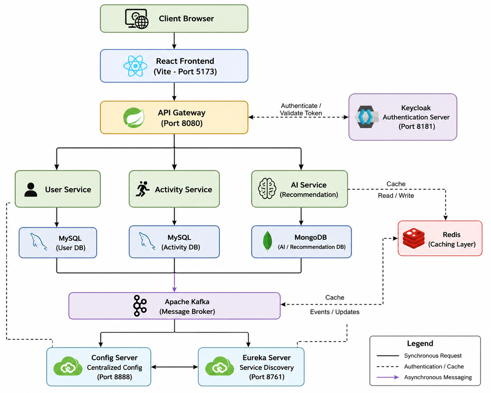

# Fitness Microservices Platform

A comprehensive fitness platform built with microservices architecture, featuring AI-powered capabilities, service discovery, and centralized configuration management.

## Overview 

This platform provides a complete fitness solution with multiple specialized microservices working together to deliver a seamless user experience. The architecture follows best practices for scalability, maintainability, and resilience.

## Architecture Diagram



```
┌─────────────────────────────────────────────────────────────────┐
│                         Client Browser                          │
└───────────────────────────┬─────────────────────────────────────┘
                            │
                            ▼
                ┌───────────────────────┐
                │  React Frontend       │
                │  (Vite - Port 5173)   │
                └───────────┬───────────┘
                            │
                            ▼
                ┌───────────────────────┐
                │   API Gateway         │
                │   (Port 8080)         │
                └───────────┬───────────┘
                            │
        ┌───────────────────┼───────────────────┐
        │                   │                   │
        ▼                   ▼                   ▼
┌──────────────┐    ┌──────────────┐    ┌──────────────┐
│ User Service │    │Activity Svc  │    │  AI Service  │
│              │    │              │    │              │
└──────────────┘    └──────────────┘    └──────────────┘
        │                   │                   │
        └───────────────────┼───────────────────┘
                            │
                            ▼
                ┌───────────────────────┐
                │  Eureka Server        │
                │  Service Discovery    │
                │  (Port 8761)          │
                └───────────────────────┘
                            │
                            ▼
                ┌───────────────────────┐
                │  Config Server        │
                │  Centralized Config   │
                │  (Port 8888)          │
                └───────────────────────┘
```

### Architecture Components

- **Frontend (React)**: User interface built with Vite
- **API Gateway**: Single entry point, routes requests to appropriate microservices
- **Eureka Server**: Service registry for dynamic service discovery
- **Config Server**: Centralized configuration management for all microservices
- **Microservices**:
  - **User Service**: Handles user authentication and profile management
  - **Activity Service**: Manages fitness activities and tracking
  - **AI Service**: Provides AI-powered recommendations and analysis

## Prerequisites

- Java 17 or higher
- Maven 3.6+
- Node.js 16+ and npm
- Docker (optional, for containerized deployment)

## Technologies

### Backend
- Spring Boot
- Spring Cloud (Eureka, Config Server, Gateway)
- Java 17
- Maven

### Frontend
- React
- Vite
- JavaScript
- ESLint

## Project Structure

```
fitness microservice/
├── eureka/
│   └── eureka/                    # Service Discovery
│       ├── src/
│       │   ├── main/
│       │   │   ├── java/com/fitness/eureka/
│       │   │   │   └── EurekaApplication.java
│       │   │   └── resources/
│       │   │       └── application.yml
│       │   └── test/
│       ├── pom.xml
│       ├── mvnw
│       └── HELP.md
├── configserver/
│   └── configserver/              # Configuration Server
│       ├── src/
│       ├── pom.xml
│       ├── mvnw
│       └── HELP.md
├── gateway/
│   └── gateway/                   # API Gateway
│       ├── src/
│       ├── pom.xml
│       └── mvnw
├── userservice/
│   └── userservice/               # User Management
│       ├── src/
│       ├── pom.xml
│       └── mvnw
├── activityservice/
│   └── activityservice/           # Activity Tracking
│       ├── src/
│       ├── pom.xml
│       ├── mvnw
│       └── HELP.md
├── aiservice/
│   └── aiservice/                 # AI Features
│       ├── src/
│       ├── pom.xml
│       ├── mvnw
│       └── HELP.md
├── fitness-frontent/              # React Frontend
│   ├── src/
│   ├── public/
│   ├── index.html
│   ├── package.json
│   ├── vite.config.js
│   ├── eslint.config.js
│   └── README.md
└── readme.md                      # This file
```

## Getting Started

### 1. Clone the Repository

```bash
git clone <repository-url>
cd "fitness microservice"
```

### 2. Start Services in Order

#### Start Eureka Server (Service Discovery)

```bash
cd eureka/eureka
mvn clean install
mvn spring-boot:run
```

Eureka Dashboard: `http://localhost:8761`

#### Start Config Server

```bash
cd ../../configserver/configserver
mvn clean install
mvn spring-boot:run
```

Config Server: `http://localhost:8888`

#### Start API Gateway

```bash
cd ../../gateway/gateway
mvn clean install
mvn spring-boot:run
```

API Gateway: `http://localhost:8080`

#### Start Microservices

**User Service:**
```bash
cd ../../userservice/userservice
mvn clean install
mvn spring-boot:run
```

**Activity Service:**
```bash
cd ../../activityservice/activityservice
mvn clean install
mvn spring-boot:run
```

**AI Service:**
```bash
cd ../../aiservice/aiservice
mvn clean install
mvn spring-boot:run
```

### 3. Start Frontend

```bash
cd ../../fitness-frontent
npm install
npm run dev
```

Frontend: `http://localhost:5173`

## Service Ports

| Service | Default Port | Description |
|---------|--------------|-------------|
| Eureka Server | 8761 | Service Discovery Dashboard |
| Config Server | 8888 | Centralized Configuration |
| API Gateway | 8080 | Single Entry Point |
| User Service | Dynamic | Registered with Eureka |
| Activity Service | Dynamic | Registered with Eureka |
| AI Service | Dynamic | Registered with Eureka |
| Frontend | 5173 | React Application (Vite) |

## Development Workflow

### Startup Sequence

1. **Eureka Server** - Start first (service discovery must be available)
2. **Config Server** - Start second (centralized configuration)
3. **API Gateway** - Start third (routing layer)
4. **Microservices** - Start in any order (they will register with Eureka)
5. **Frontend** - Start last

### Verification Steps

1. Check Eureka Dashboard at `http://localhost:8761` to verify all services are registered
2. Verify Config Server is accessible at `http://localhost:8888`
3. Test API Gateway endpoints at `http://localhost:8080`
4. Access the frontend application at `http://localhost:5173`

## Building for Production

### Build All Backend Services

```bash
# Build Eureka Server
cd eureka/eureka
mvn clean package -DskipTests

# Build Config Server
cd ../../configserver/configserver
mvn clean package -DskipTests

# Build API Gateway
cd ../../gateway/gateway
mvn clean package -DskipTests

# Build User Service
cd ../../userservice/userservice
mvn clean package -DskipTests

# Build Activity Service
cd ../../activityservice/activityservice
mvn clean package -DskipTests

# Build AI Service
cd ../../aiservice/aiservice
mvn clean package -DskipTests
```

### Build Frontend

```bash
cd fitness-frontent
npm run build
```

The production build will be available in the `dist/` directory.

## API Documentation

- **Eureka Dashboard**: `http://localhost:8761`
- **API Gateway**: `http://localhost:8080`
- **Swagger UI**: Available on individual services (if configured)

## Configuration

Configuration files are managed centrally through the Config Server. Each service has its own `application.yml` in the `src/main/resources/` directory.

### Example Configuration Structure

- `eureka/eureka/src/main/resources/application.yml` - Eureka Server configuration
- Each microservice registers with Eureka and fetches configuration from Config Server

## Docker Deployment (Optional)

To deploy using Docker, create a `Dockerfile` for each service and a `docker-compose.yml` at the root:

```dockerfile
# Example Dockerfile for a microservice
FROM openjdk:17-jdk-slim
WORKDIR /app
COPY target/*.jar app.jar
EXPOSE 8080
ENTRYPOINT ["java", "-jar", "app.jar"]
```

## Testing

### Run Tests for All Services

```bash
# Test Eureka Server
cd eureka/eureka
mvn test

# Test other services similarly
cd ../../aiservice/aiservice
mvn test
```

### Frontend Tests

```bash
cd fitness-frontent
npm test
```

## Troubleshooting

### Common Issues

1. **Services not registering with Eureka**
   - Ensure Eureka Server is running first
   - Check `application.yml` for correct Eureka URL
   - Verify network connectivity

2. **Port conflicts**
   - Check if ports 8761, 8888, 8080, 5173 are available
   - Modify port configurations in `application.yml` if needed

3. **Maven build failures**
   - Run `mvn clean install` to refresh dependencies
   - Check Java version (must be 17+)

4. **Frontend build issues**
   - Delete `node_modules` and run `npm install` again
   - Clear npm cache: `npm cache clean --force`

### Logs

Check service logs for detailed error messages:
- Backend services: Console output from `mvn spring-boot:run`
- Frontend: Browser console and terminal output

## Contributing

1. Fork the repository
2. Create a feature branch (`git checkout -b feature/amazing-feature`)
3. Commit your changes (`git commit -m 'Add amazing feature'`)
4. Push to the branch (`git push origin feature/amazing-feature`)
5. Open a Pull Request

### Code Style

- Follow Java naming conventions for backend code
- Use ESLint configuration for frontend code
- Write unit tests for new features
- Update documentation as needed

## License

This project is licensed under the MIT License.

## Support

For questions or support:
- Open an issue in the repository
- Check existing documentation in individual service `HELP.md` files
- Review Spring Cloud documentation for microservices patterns
  

## Contact

For questions or support, please open an issue in the repository.

